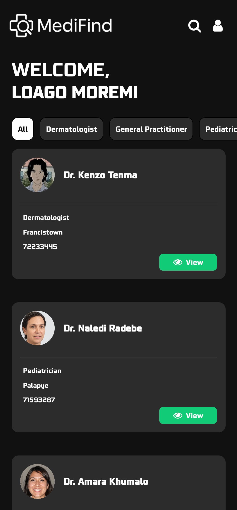
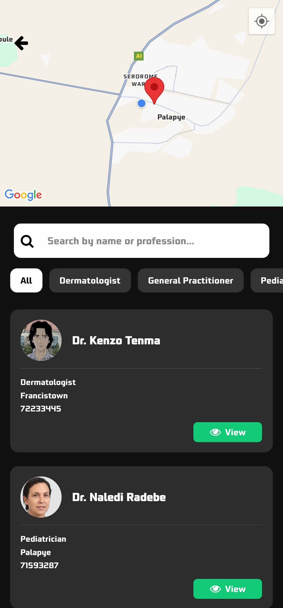
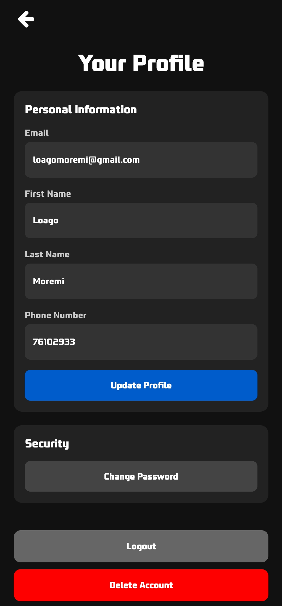
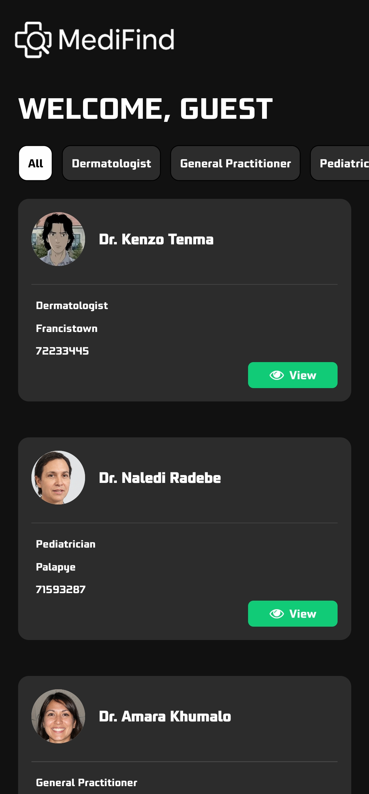

<div align="center">
  <h1>🩺 MediFind</h1>
  <p><strong>Doctor Discovery & Booking App — Mobile App (Expo) + Web Admin Dashboard</strong></p>

  <p>
    
    
    
    
    
  </p>

  <p>
  
  
  
  
</p>

  <p>
    <a href="#📱-mobile-app">📱 Mobile App</a> •
    <a href="#💻-web-admin">💻 Web Admin</a> •
    <a href="#🔧-tech-stack">🔧 Tech Stack</a> •
    <a href="#🚀-setup">🚀 Setup</a>
  </p>
</div>

---

## 🌍 Overview

**MediFind** is a full-stack healthcare duo:
- **Mobile App** (Expo) for patients to discover & book docs  
- **Web Dashboard** for admins to manage providers & generate reports  

---

## 🔧 Tech Stack

| 🏙 Platform     | 🛠️ Tools Used                                           |
|-----------------|--------------------------------------------------------|
| **Mobile App**  | React Native (Expo), Firebase Auth & Firestore, Expo Router |
| **Web Dashboard** | React + Vite, Firebase, Tailwind CSS, React Router     |
| **Backend**     | Firebase Functions (optional), Firestore Rules         |

---

## 📁 Project Structure

/MediFind ├── /mobile → Expo mobile app ├── /web → React web admin dashboard

---

### Each folder contains its own README with install + dev instructions.

- See `/mobile/README.md` for mobile app setup
- See `/web/README.md` for admin web dashboard setup

## 🚀 Setup

### 🧪 Prerequisites
- Node.js installed
- Firebase project created

### 📱 Mobile App Setup (Expo)
```bash
cd mobile
npm install
npm run start
```
### Then press: 
- `a` to open Android
- `i` to open iOS
- `w` for web view

### Your Firebase config should live in: 
- `/mobile/app/firebase.js`

## 💻 Web App Setup (Vite or CRA)
```bash
cd web
npm install
npm run dev   # or npm start if using CRA
```
### Your Firebase config should live in: 
- `/web/src/firebase/config.js`

## 👨‍⚕️ Features
### Mobile
- Register / login (Email, Google)
- View and search doctor profiles
- Book appointments
- View + edit profile
- Guest mode support

### Web Admin
- Login (Username + Password)
- Add / edit doctors
- View dashboard stats
- Generate reports

## 🧠 Author Notes
This project was built with scalability in mind. It supports real-time data sync across platforms and follows clean UI/UX design inspired by modern healthcare systems.
